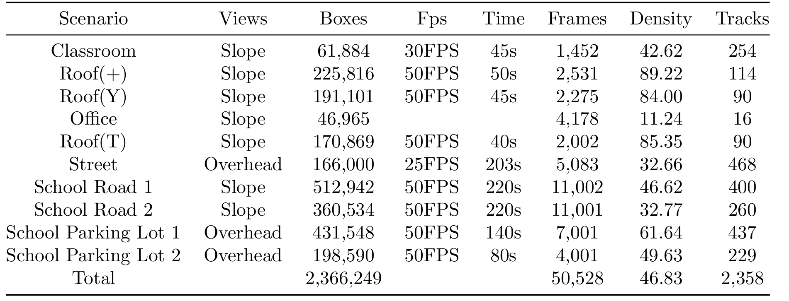
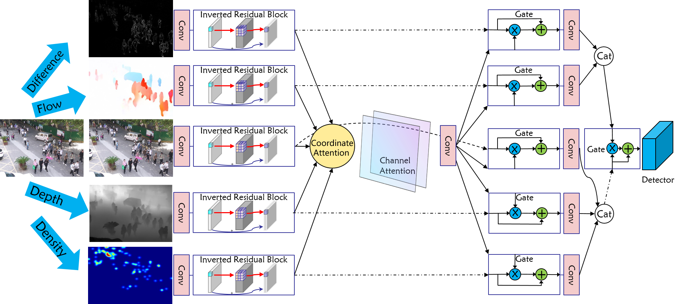

# Cchead


Code and Dataset for paper: [Toward Pedestrian Head Tracking: A Benchmark Dataset and an Information Fusion Network](https://arxiv.org/abs/2408.05877)

 

 
## What we do
We present a Chinese Large-scale Cross-scene Pedestrian Head Tracking dataset (Cchead) and a Multi-Source Information Fusion Network (MIFN). Our dataset has features that are of considerable interest, including 10 diverse scenes of 50,528 frames with over 2,366,249 heads and 2,358 tracks annotated manually. 


## Demo show
Video Demo: https://drive.google.com/drive/folders/1BLmzCRx3MbOzVUITw0-RCpRqTHJ2JXYQ?usp=sharing


## Dataset Download


Dataset Download: [Cchead](https://doi.org/10.34740/kaggle/dsv/11921379). 


# Cchead Dataset Usage

<!---
https://cloud.tsinghua.edu.cn/d/a9f2703b83a54dc7b569/
-->

Dataset  directory:
The main directory includes: one annotations file(annotations);  one label file (labels_with_ids);test images (test_classroom, indoor_test,etc.), each corresponding to a different scene.


Utilizing the Full Dataset:
1.  Make a new filefolder 'cchead'；
2.  Unzip 'annotations.rar' into 'cchead/annotations' and, then unzip 'labels_with_ids.rar' into  'cchead/labels_with_ids'  ;
3.  Make new filefolders 'cchead/images/train' and 'cchead/images/test';
4.  Unzip 'xxx_train.rar' into 'cchead/images/train', Unzip 'xxx_test.rar' into 'cchead/images/test', 'xxx' refers to names of video sequences

Dataset  directory:

      --images
         --train
            --90cross_25fps
               --img
                  --0.jpg
                  --1.jpg
                --gt
                   --gt.txt
                --seqinfo.ini
             ......
        
         --test
            --90cross_25fps
               --img
                  --0.jpg
                  --1.jpg
                --gt
                   --gt.txt
                --seqinfo.ini
             ......
             
      --labels_with_ids
         --train
            --90T_25fps
               --img
                  --0.txt
                  --1.txt
                  ......
      
         --test
            --90cross_25fps
               --img
                  --0.txt
                  --1.txt
                ......
      --annotations

where gt.txt is used for evaluation, it is formed as:

      1,1,57,86,28,32,1,1,1  (frame_id, track_id, xy (left&up) wh,...)
      2,1,55,87,28,32,1,1,1
      3,1,60,85,28,32,1,1,1
      4,1,63,85,29,31,1,1,1
      5,1,64,85,29,31,1,1,1
      ...
      1,2,65,146,50,56,1,1,1 (frame_id, track_id, xy (left&up) wh,...)

label files for training such as 0.txt is formed as:

      0 186 0.23671875 0.25069444444444444 0.0067708333333333336 0.015277777777777777 (class_ind, track_id, xy (center) wh)
      .......

xywhs in label files are all scaled to (0,1)

seqinfo.ini contains the following information:

[Sequence]
name=90T_25fps;
imDir=img;
frameRate=25;
seqLength=1110;
imWidth=1920;
imHeight=1080;
imExt=.jpg.


If you want to run experiments based on PaddleDetection, please read the following.


## Environment
- The code is tested on Ubuntu 20.04.2, python 3.9, cuda 11.7，Paddle 2.4.2, PaddleDet 2.6.


## Installation

Please refer to [Installation](https://github.com/PaddlePaddle/PaddleDetection/blob/release/2.6/docs/tutorials/INSTALL_cn.md) for installation instructions of Paddle and PaddleDet.

We modified the code in PaddleDet. Please clone our code and replace the original code in PaddleDet.
  
## Train
```Bash
python -m paddle.distributed.launch --log_dir=./fairmot_dla34_ourdata_30e_1088x608_mifn/ --gpus 0,1,2,3 tools/train.py -c configs/mot/fairmot/fairmot_ourdata_dla34_30e_1088x608_mifn.yml```
```

## Testing Models on the whole dataset

```Bash
CUDA_VISIBLE_DEVICES=1 python tools/eval_mot.py -c configs/mot/fairmot/fairmot_ourdata_dla34_30e_1088x608_mifn.yml -o weights=<path to weights>
```


## Citation

```
@article{sun2024toward,
         title = {Toward Pedestrian Head Tracking: A Benchmark Dataset and an Information Fusion Network},
         author = {Sun, Kailai and Wang, Xinwei and Liu, Shaobo and Zhao, Qianchuan and Huang, Gao and Liu, Chang},
         journal={arXiv preprint arXiv:2408.05877},
         year = {2024}.         
}
```

## License

The repository is licensed under the [Apache 2.0 license](LICENSE).

## Contact Us

If you have other questions❓, please contact us in time 👬


## Acknowledgement

This work was sponsored by grants from National Science Foundation of China (Grant No. 52172308), Department of Transport of Hubei Province (Contract No. 2022- 11-4-4), National Natural Science Foundation of China under Grant No. 62192751 and the 111 International Collaboration Program of China under Grant No. BP2018006.
